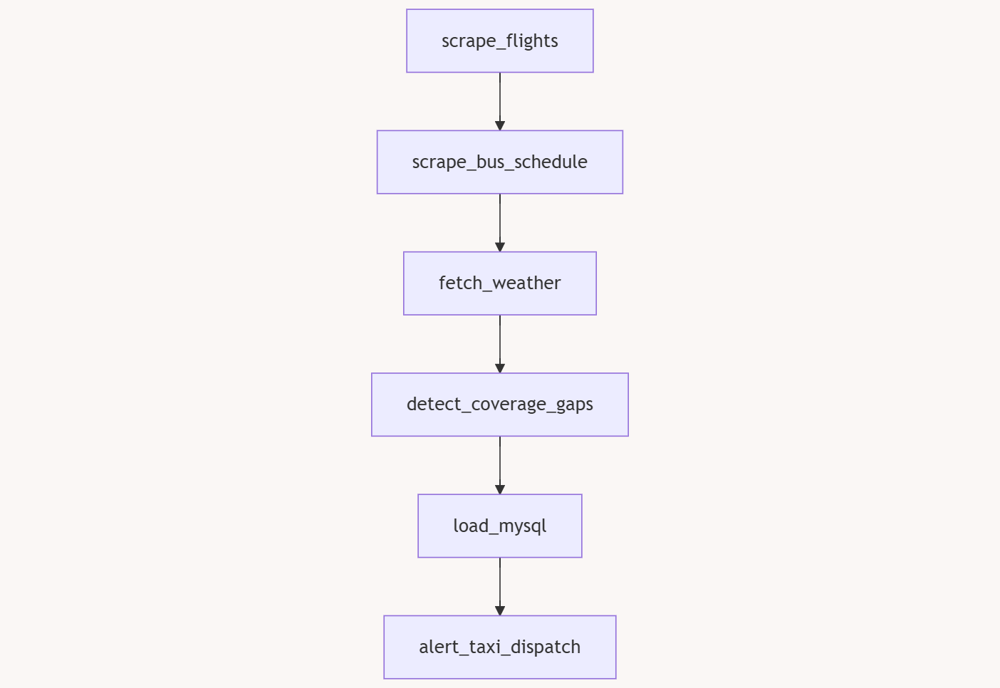
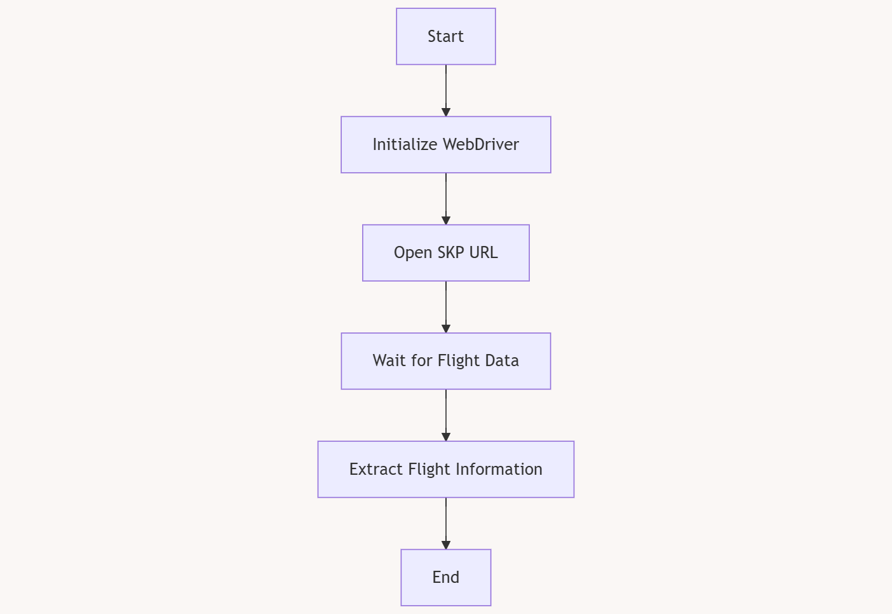
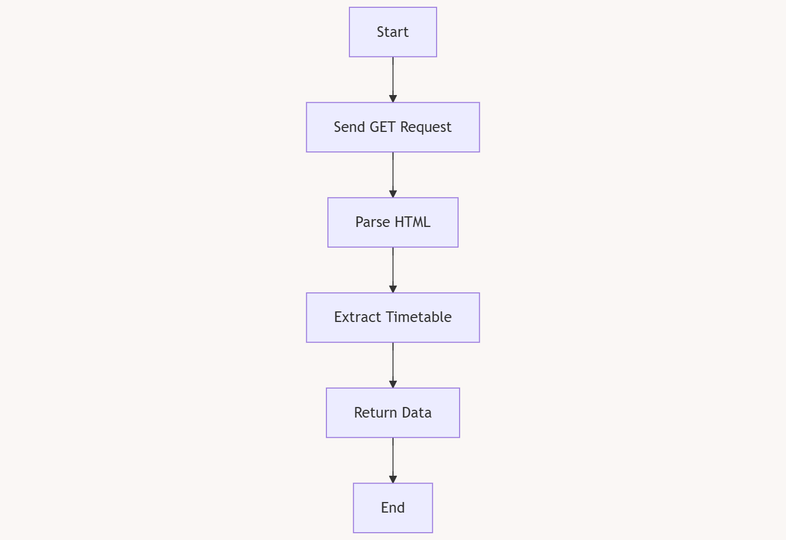

# Project Documentation

## Project Overview
The project aims to build a Taxi Demand Prediction Pipeline for SKP Airport. The objective is to identify time windows with insufficient bus coverage at SKP Airport by combining flight arrivals, WTransporter schedules, and weather data to predict optimal taxi dispatch times. This automated system will help in reducing missed revenue during bus gaps by ensuring timely taxi dispatch.

## Architecture and Design
### Data Sources
1. **Flight Arrivals**: 
    - Source: SKP Airport Arrivals Page
    - Data: Flight times, airline, origin, status (dynamic HTML)
2. **Bus Schedules**: 
    - Source: WTransporter Timetable
    - Data: Winter 2024/25 schedule (08:00–20:00 daily)
3. **Weather API**: 
    - Source: OpenWeatherMap
    - Data: Temperature, precipitation, wind speed

### Pipeline Architecture
The data pipeline is designed to scrape data from the above sources, detect coverage gaps, and load the results into a MySQL database. The pipeline is orchestrated using Apache Airflow.



### Key Components
1. **Scraping Logic**
    - **Flights (Python + Selenium)**:
      
    - **Bus Schedule (Static Scrape)**:
      

2. **Weather Integration**
    

3. **Gap Detection Logic**
    

4. **Storage (MySQL)**
    

### Airflow DAG


## Setup and Configuration
1. **Environment Setup**:
    - Install Python and required libraries (Selenium, BeautifulSoup, requests, pandas, etc.)
    - Set up MySQL database and create necessary tables.
    - Configure Apache Airflow and define the DAG as shown above.

2. **Configuration**:
    - Set environment variables for API keys and database credentials.
    - Schedule the Airflow DAG to run hourly.

## Results
The pipeline successfully identifies time windows with insufficient bus coverage and predicts the number of taxis needed. Sample output:
```
2025-02-08 22:15: No buses. Predicted taxis needed: 12 (rain)
```

## Ethical Considerations
- Avoid scraping SKP/WTransporter during peak hours.
- Cache bus schedule

## Error Handling and Monitoring
- Data quality checks implemented for flight data validation
- Airflow alerts configured for failed tasks
- Monitoring dashboard for:
  - Scraping success rates
  - Data freshness metrics
  - Pipeline execution times
- Error logs stored in MySQL for auditing

## Performance Optimization
- Implemented caching strategy for bus schedules
- Parallel processing for flight data scraping
- Database indexing on timestamp columns
- Connection pooling for MySQL operations

## Future Enhancements
- Integration with additional data sources (e.g., traffic data)
- Machine learning model improvement for demand prediction
- Real-time notification system for taxi dispatchers
- API development for external system integration

### Testing and Validation
- Unit tests for scraping components
- Integration tests for pipeline workflows
- Data validation checks:
  - Schema validation
  - Data completeness checks
  - Historical data comparison
- Regular end-to-end pipeline testing